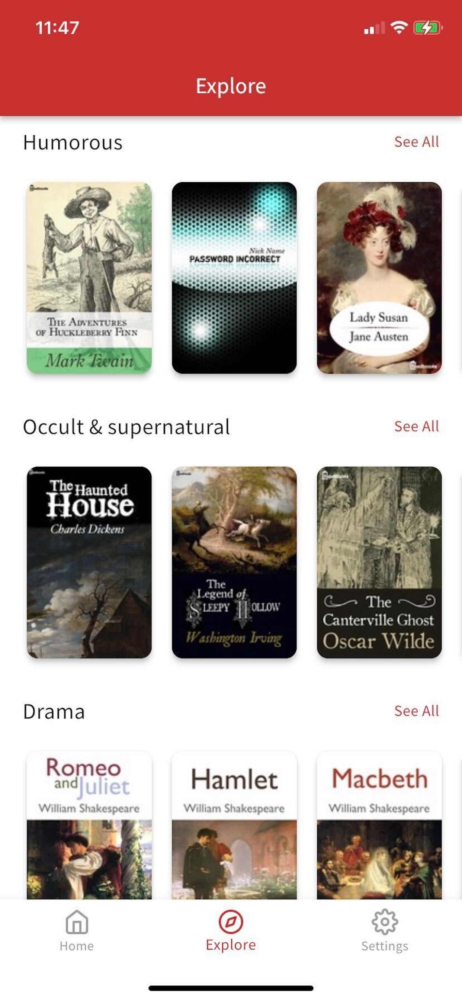
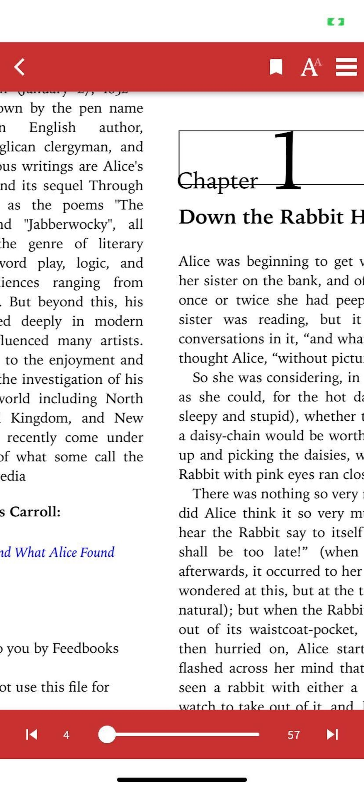

# Flutter eBook App

[//]: # ([![Codemagic build status]&#40;https://api.codemagic.io/apps/5e230defc5faa60315b1df62/5e230defc5faa60315b1df61/status_badge.svg&#41;]&#40;https://codemagic.io/apps/5e230defc5faa60315b1df62/5e230defc5faa60315b1df61/latest_build&#41;)

A simple demo of the Iridium reader SDK based on [JideGuru's excellent Flutter Ebook App](https://github.com/JideGuru/FlutterEbookApp) (_Please note that for technical reasons the current Git history doesn't contain JideGuru's original code: it will be added back shortly_).

The Books included in the app are from the [Public Domain](https://en.wikipedia.org/wiki/Public_domain)
(Expired Copyright and completely free).

[//]: # ( )

[//]: # (<a href="https://www.vecteezy.com/vector-art/599678-book-reading-logo-and-symbols-template-icons">App)

[//]: # (icon</a>    )

[//]: # (To download this app, <a href="https://codemagic.io/apps/5e230defc5faa60315b1df62/5e230defc5faa60315b1df61/latest_build">click here</a> to see the codemagic builds. You can choose to install the `apk` or the `ipa&#40;ios&#41;`.)

[//]: # (<!--)

[//]: # (<a href="https://play.google.com/store/apps/details?id=dev.jideguru.flutterEbookApp"></img></a> -->)

[//]: # (  Please star⭐ the repo if you like what you see😉.)

## Requirements

- Any Operating System (ie. MacOS X, Linux, Windows)
- Any IDE with Flutter SDK installed (ie. IntelliJ, Android Studio, VSCode etc)
- A little knowledge of Dart and Flutter

## Features

- [x] Download eBooks.
- [x] Read eBooks.
- [x] Favorites.
- [x] Dark Mode
- [x] Swipe to delete downloads.

## ScreenShots

<!--  -->

| Light                                                              | Dark                                                                |
|--------------------------------------------------------------------|---------------------------------------------------------------------|
|      |  |
|  |                                     |
|    |                                     |
|      |                                     |
|  |                                    |
|     | |
|  |                                    |

## Plugins

| Name                                              | Usage                                         |
|---------------------------------------------------|-----------------------------------------------|
| [**Provider**](https://pub.dev/packages/provider) | State Management                              |
| [**Object DB**](https://pub.dev/packages/objectdb) | NoSQL database to store Favorites & Downloads |
| [**XML2JSON**](https://pub.dev/packages/xml2json) | Convert XML to JSON                           |
| [**DIO**](https://pub.dev/packages/dio)           | Network calls and File Download               |
| [**Mno OPDS**](https://pub.dev/packages/mno_opds) | OPDS parsers                                  |

## Author(s)

### Original JideGuru app:
**Olusegun Festus Babajide**

## LICENCE

[BSD 3-clause](https://github.com/Mantano/iridium/blob/develop/app/LICENSE)
